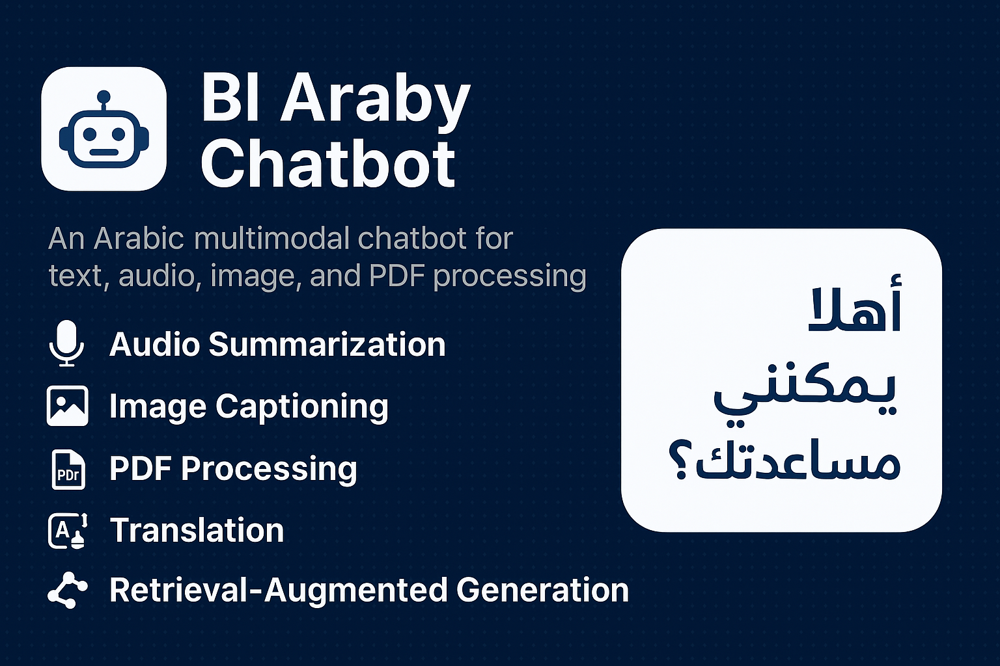

<p align="center">
  
</p>

# 🤖 Bl-Araby-Chatbot

Bl-Araby-Chatbot is an advanced Arabic-language chatbot designed to process and generate natural language responses for various tasks, including audio summarization, image captioning, PDF processing, and Retrieval-Augmented Generation (RAG). This project leverages state-of-the-art NLP and machine learning techniques to provide a seamless experience for Arabic-speaking users.


## Table of Contents
- [Features](#features)
- [Project Structure](#project-structure)
- [Installation](#installation)
- [Usage](#usage)
- [Model and Data Access](#model-and-data-access)
- [Contributing](#contributing)
- [License](#license)
- [Contact](#contact)

## Features
- **Audio Summarization**: Summarize Arabic audio files, such as news clips, into concise text.
- **Image Captioning**: Generate descriptive captions for images in Arabic using deep learning models.
- **PDF Processing**: Extract and summarize content from PDF documents.
- **Translation**: Translate text to and from Arabic for multilingual support.
- **Retrieval-Augmented Generation (RAG)**: Provide context-aware responses using external knowledge sources.
- **Modular Design**: Organized codebase with separate modules for each functionality.

## Project Structure
```
Bl-Araby-Chatbot/
├── data/                    # Sample data for testing
│   ├── audio/              # Audio files (e.g., arabic_news_summary.wav)
│   └── images/             # Image files (e.g., coco_sample_000000000009.jpg)
├── docs/                   # Documentation and presentations
│   └── project_presentation.pptx
├── notebooks/              # Jupyter notebooks for experimentation
│   └── arabic_image_captioning.ipynb
├── src/                    # Source code
│   ├── chat/              # Chatbot functionalities
│   │   ├── chat_audio.py
│   │   ├── chat_image.py
│   │   ├── chat_pdf.py
│   │   └── translation.py
│   ├── image_captioning/  # Image captioning module
│   │   ├── image_captioning.py
│   │   ├── decoder_model.h5
│   │   ├── encoder_model.h5
│   │   ├── tokenizer.pickle
│   │   ├── max_length.txt
│   │   └── units.txt
│   ├── rag/               # Retrieval-Augmented Generation module
│   │   └── rag_config.txt
│   └── summarization/     # Summarization module
│       ├── models.py
│       ├── summarize_audio.py
│       └── summarize_pdf.py
├── tests/                  # Unit tests (work in progress)
├── .env                   # Environment variables (not tracked)
├── .gitignore             # Git ignore file
├── LICENSE                # MIT License
├── README.md              # Project documentation
├── requirements.txt        # Python dependencies
└── setup.py               # Setup script for package installation
```

## ⚙️ Installation

1. **Clone the repository**:
   ```bash
   git clone https://github.com/salemnka7/Bl-Araby-Chatbot.git
   cd Bl-Araby-Chatbot
   ```

2. **Create a virtual environment (recommended)**:
   ```bash
   python -m venv venv
   # Activate it
   source venv/bin/activate   # On Linux/Mac
   venv\Scripts\activate      # On Windows
   ```

3. **Install dependencies**:
   ```bash
   pip install -r requirements.txt
   ```

4. **Set up environment variables**:
   - Create a `.env` file in the root directory.
   - Add necessary API keys or configuration (e.g., for translation or RAG services).

   Example `.env`:
   ```text
   API_KEY=your_api_key_here
   ```

5. **Download models and data**:
   - Download pre-trained models and sample data from Google Drive or Hugging Face.  
   - Place them in the appropriate directories (`src/image_captioning/` for models, `data/` for sample files).

---

## ▶️ Usage

### 🔹 Summarize an audio file
```bash
python src/summarization/summarize_audio.py --input data/audio/arabic_news_summary.wav
```

### 🔹 Generate an image caption
```bash
python src/image_captioning/image_captioning.py --image data/images/coco_sample_000000000009.jpg
```

### 🔹 Summarize a PDF
```bash
python src/summarization/summarize_pdf.py --input your_pdf_file.pdf
```

### 🔹 Translate text
```bash
python src/chat/translation.py --text "Hello, world!" --target_lang ar
```

### 🔹 Run the chatbot (audio example)
```bash
python src/chat/chat_audio.py --input data/audio/sample.wav
```

For more details, see the Jupyter notebook:  
👉 `notebooks/arabic_image_captioning.ipynb`

---

## 📊 Model and Data Access

- **Pre-trained Models**: Available on Google Drive or Hugging Face. Download and place them in `src/image_captioning/`.  
- **Sample Data**: Provided in the `data/` folder. For larger datasets, check the provided cloud storage links.  

⚠️ Note: Large files are not stored in the repository to comply with GitHub size limits.

---

## 🤝 Contributing

Contributions are welcome!  

1. Fork the repository  
2. Create a new branch  
   ```bash
   git checkout -b feature/your-feature
   ```
3. Commit your changes  
   ```bash
   git commit -m "Add your feature"
   ```
4. Push to the branch  
   ```bash
   git push origin feature/your-feature
   ```
5. Open a Pull Request  

Please follow the Contributor Covenant Code of Conduct and ensure your code adheres to **PEP 8 standards**.  
Add tests in the `tests/` directory where possible.

---

## 📜 License

This project is licensed under the **MIT License** – see the [LICENSE](LICENSE) file for details.

---

## 📬 Contact

👤 **Ahmed Salem** – AI & Data Science Engineer  

- GitHub: [salemnka7](https://github.com/salemnka7)  
- LinkedIn: [Ahmed Salem](https://www.linkedin.com/in/ahmed-salem-ai)  
- Email: ahmmed.salem.ai@gmail.com  

⭐ If you find this project useful, please give it a star on GitHub!
